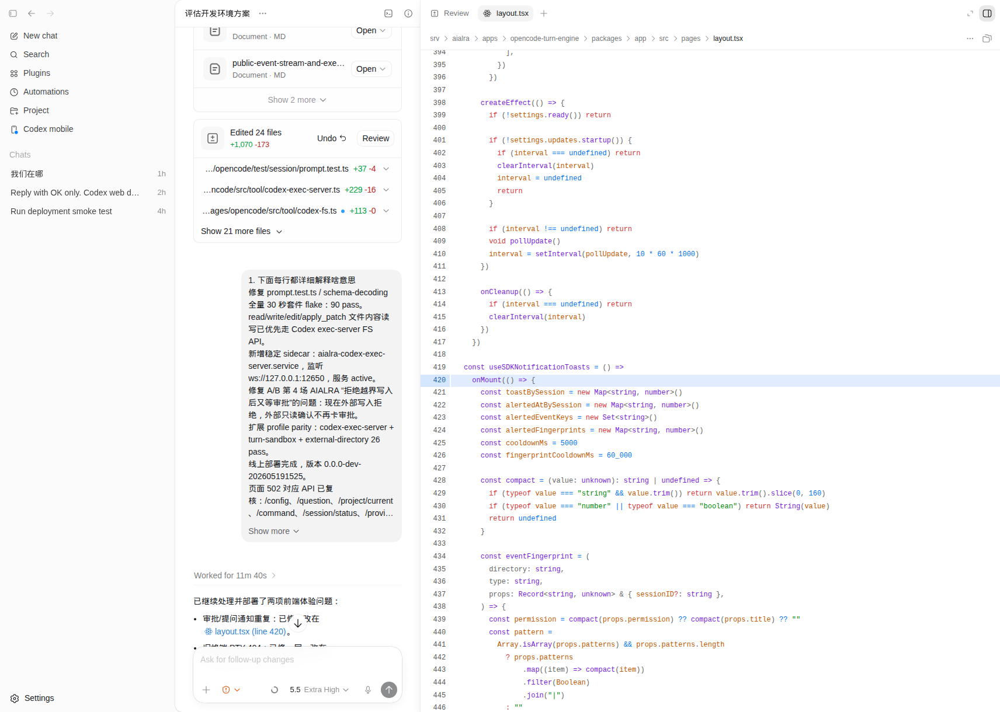

# Codex App Web Gateway

Self-hosted web gateway for running the Codex Desktop webview in a browser while keeping the Codex runtime on a machine you control.

This project serves extracted Codex Desktop webview assets, injects a small browser bridge, forwards Codex MCP traffic to `codex app-server`, and adds an optional form-login proxy for public deployments.

> Status: experimental. Codex Desktop is not an official web app. This gateway emulates enough of the Electron host surface for core workflows, but it is not a complete replacement for the official desktop clients.

[中文说明](README.zh-CN.md)

## Preview

The login proxy adds a simple deployment gate in front of the Codex webview. The example username in this screenshot is sanitized.


Once signed in, the browser talks to the gateway bridge and the bridge forwards Codex traffic to `codex app-server`.


Linked file references can open beside the active conversation when the gateway shim can resolve the server-side path.



## What This Is

Codex App Web Gateway is a production-oriented wrapper around the Codex Desktop renderer:

- Serves the Codex Desktop `webview/` bundle over HTTP.
- Injects `window.electronBridge` for the browser.
- Starts and proxies to `codex app-server`.
- Implements common `vscode://codex/...` host methods in Node.js.
- Persists lightweight UI host state separately from `CODEX_HOME`.
- Adds a simple signed-cookie login proxy.
- Ships Docker and systemd examples.

## What This Is Not

- It is not OpenAI official software.
- It is not a redistribution of the Codex Desktop application.
- It does not include Codex Desktop assets in this repository.
- It does not provide shared accounts or an account pool.
- It does not guarantee full parity with Electron-only desktop features.

## References

This repository is inspired by and should be read alongside:

- [`ilysenko/codex-desktop-linux`](https://github.com/ilysenko/codex-desktop-linux), which converts the official macOS Codex Desktop package into a Linux Electron app.
- [`0xcaff/codex-web`](https://github.com/0xcaff/codex-web), which provides a browser frontend and Electron shim for Codex Desktop.

This project focuses on a small deployable gateway with explicit login protection, Docker packaging, and pluggable private-deployment hooks.

## Capability Boundary

Known working areas:

- Main Codex webview boot.
- Codex account status through the host `CODEX_HOME`.
- New chats and normal Codex turns through `codex app-server`.
- Basic settings, projectless workspaces, pinned threads, and plugin marketplace screens.
- File metadata/text/binary reads for paths accessible to the server process.

The gateway keeps the core prompt controls available, including model/reasoning selection and permission modes:


The plugin marketplace page loads through the same webview bridge. Plugin runtime support still depends on the server environment and each plugin's host requirements.


Known limitations:

- Browser panel, terminal integration, Computer Use, native desktop notifications, global hotkeys, tray behavior, and OS-level window control are partial or unavailable.
- Upstream Codex Desktop bundle changes can break host-method assumptions.
- Public exposure is high risk: anyone who can use the web UI can operate Codex as the server user.
- Automatic account switching is not provided by default. Use your own private account-provider integration if you need that.

## Security Model

Treat the gateway as remote access to the Unix user running `codex`.

The user behind the browser may be able to:

- Run commands through Codex.
- Read and write files accessible to the server process.
- Use the Codex or ChatGPT account signed in under `CODEX_HOME`.
- Consume usage quota or billing credits for that account.

Minimum recommendations:

- Put the service behind HTTPS.
- Keep `CODEXAPP_PASSWORD` and `CODEXAPP_SESSION_SECRET` outside git.
- Run as a dedicated low-privilege user.
- Mount only the directories the agent should access.
- Do not expose this directly to the public internet without authentication and network controls.

## Quick Start With Docker

1. Build the image:

```bash
docker build -t codex-app-web-gateway:local .
```

The default Docker build downloads the official Codex Desktop macOS archive, extracts `app.asar`, and copies only the `webview/` bundle into the image. Override the source if needed:

```bash
docker build \
  --build-arg CODEX_DESKTOP_APP_VERSION=26.506.31421 \
  --build-arg CODEX_DESKTOP_ARCHIVE_URL=https://persistent.oaistatic.com/codex-app-prod/Codex-darwin-arm64-26.506.31421.zip \
  -t codex-app-web-gateway:local .
```

2. Create a persistent data directory:

```bash
mkdir -p ./data/codex-home ./data/state
```

3. Sign in Codex on the host-side `CODEX_HOME` before exposing the service:

```bash
docker run --rm -it \
  --entrypoint bash \
  -v "$PWD/data/codex-home:/data/codex-home" \
  codex-app-web-gateway:local \
  -lc 'CODEX_HOME=/data/codex-home codex login --device-auth'
```

4. Run the gateway:

```bash
docker run --rm -p 8080:8080 \
  -e CODEXAPP_USERNAME='admin@example.com' \
  -e CODEXAPP_PASSWORD='change-me' \
  -e CODEXAPP_SESSION_SECRET="$(openssl rand -hex 32)" \
  -v "$PWD/data:/data" \
  codex-app-web-gateway:local
```

5. Open:

```text
http://127.0.0.1:8080
```

## Docker Compose

Copy the example and provide secrets through your shell or an `.env` file that is not committed:

```bash
cp examples/env.example .env
docker compose -f examples/docker-compose.yml --env-file .env up -d --build
```

Health check:

```bash
curl -fsS http://127.0.0.1:8080/health
```

## Host Install

Install Node.js and Codex CLI, then prepare the webview bundle:

```bash
npm install
npm run prepare:webview
codex login --device-auth
```

Start the bridge and login proxy in separate terminals:

```bash
CODEX_HOME="$HOME/.codex" \
CODEXAPP_STATE_DIR="$PWD/data/state" \
CODEXAPP_WEBVIEW_DIR="$PWD/webview" \
node src/web-server.js
```

```bash
CODEXAPP_USERNAME='admin@example.com' \
CODEXAPP_PASSWORD='change-me' \
CODEXAPP_SESSION_SECRET="$(openssl rand -hex 32)" \
node src/login-proxy.js
```

The default login proxy listens on `127.0.0.1:12903` and proxies to the web bridge on `127.0.0.1:12910`.

## Configuration

Main environment variables:

| Variable | Default | Purpose |
| --- | --- | --- |
| `CODEX_HOME` | `$HOME/.codex` | Codex auth, sessions, config, and runtime state. |
| `CODEXAPP_STATE_DIR` | `./data/state` | Gateway UI shim state. |
| `CODEXAPP_WEBVIEW_DIR` | `./webview` | Extracted Codex Desktop webview assets. |
| `CODEXAPP_CODEX_CLI` | `codex` | Codex CLI executable. |
| `CODEXAPP_WEB_HOST` | `127.0.0.1` | Internal bridge host. |
| `CODEXAPP_WEB_PORT` | `12910` | Internal bridge port. |
| `CODEXAPP_APP_SERVER_PORT` | `12911` | Internal `codex app-server` port. |
| `CODEXAPP_HOST` | `127.0.0.1` | Login proxy host. |
| `CODEXAPP_PORT` | `12903` | Login proxy port. |
| `CODEXAPP_UPSTREAM` | `http://127.0.0.1:12910` | Login proxy upstream. |
| `CODEXAPP_USERNAME` | required | Login username. |
| `CODEXAPP_PASSWORD` | required | Login password. |
| `CODEXAPP_SESSION_SECRET` | required | HMAC secret for login cookies. |

The settings surface is served from the Codex Desktop webview while host-backed settings are handled by the gateway shim.


## Account Provider Hook

The public project intentionally defaults to local Codex auth. Users should sign in with:

```bash
codex login --device-auth
```

For private deployments, add your own account provider outside this repository. A typical private provider can expose:

- `POST /lease`
- `POST /release`
- `POST /mark-quota-exhausted`
- `GET /current`

Then wire the provider into `CODEX_HOME` selection or a custom wrapper around `CODEXAPP_CODEX_CLI`. Do not commit shared account credentials.

## History Import

Conversation history is inherited when the gateway and your CLI/editor use the same `CODEX_HOME`.

Useful Codex history files include:

- `sessions/**/*.jsonl`
- `session_index.jsonl`
- `history.jsonl`
- `state_5.sqlite`
- `logs_2.sqlite`

VS Code extension-specific UI state may live outside `CODEX_HOME`; this gateway does not automatically import that state.

## Development Checks

```bash
npm test
```

The test script runs JavaScript syntax checks and a conservative repository secret scan.

## License

MIT. See [LICENSE](LICENSE).
