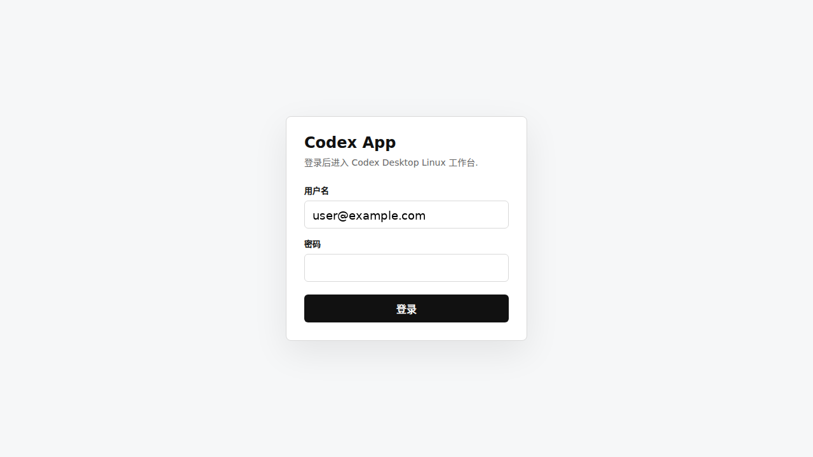
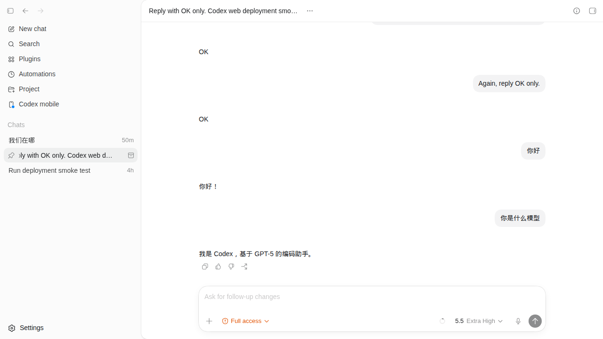
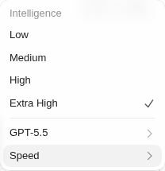
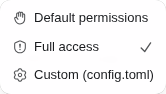
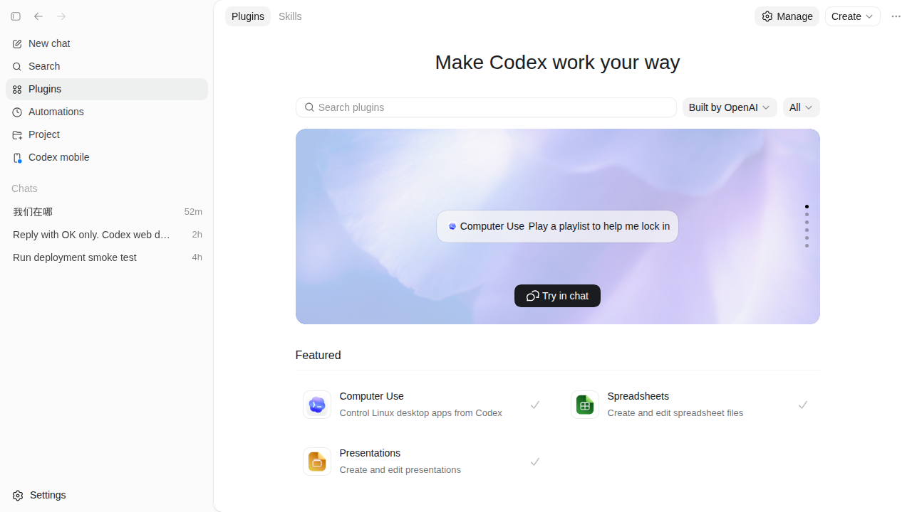
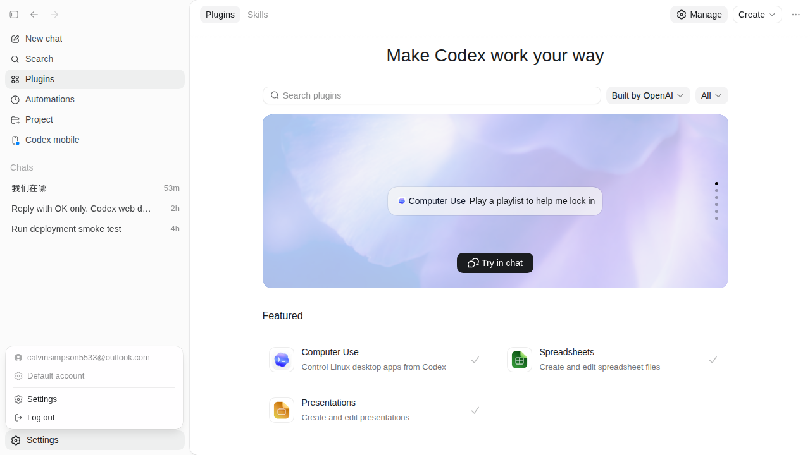

# Codex App Web Gateway

一个自托管 Web 网关：把 Codex Desktop 的 WebView 前端放到浏览器中运行，同时把 Codex runtime 留在你控制的服务器或主机上。

项目会服务已提取的 Codex Desktop `webview/` 静态资源，注入浏览器 bridge，转发 Codex MCP 流量到 `codex app-server`，并提供可选的表单登录代理，方便部署到公网域名后做一层访问保护。

> 状态：实验性。Codex Desktop 官方并没有提供 Web 版。本项目只是模拟一部分 Electron 宿主能力，能覆盖核心工作流，但不等于官方桌面客户端的完整替代品。

[English README](README.md)

## 预览

登录代理会在 Codex WebView 前面增加一层简单访问保护。截图中的用户名已经替换为示例值。



登录后，浏览器通过 gateway bridge 连接服务器上的 `codex app-server`，可以继续进行 Codex 对话。



## 项目定位

本项目关注的是“可部署的 Codex Desktop Web 网关”：

- 服务 Codex Desktop 的 `webview/` bundle。
- 在浏览器里注入 `window.electronBridge`。
- 启动并代理 `codex app-server`。
- 在 Node.js 里实现常见的 `vscode://codex/...` host method。
- 把轻量 UI shim 状态存到独立目录。
- 提供 signed-cookie 登录代理。
- 提供 Docker 和 systemd 示例。

## 它不是什么

- 不是 OpenAI 官方项目。
- 不重新分发 Codex Desktop 应用。
- 仓库里不包含官方 Codex Desktop 资源。
- 默认不提供共享账号池。
- 不保证 Electron-only 桌面能力完整可用。

## 参考项目

建议同时阅读：

- [`ilysenko/codex-desktop-linux`](https://github.com/ilysenko/codex-desktop-linux)：把官方 macOS Codex Desktop 包转换为 Linux Electron 桌面应用。
- [`0xcaff/codex-web`](https://github.com/0xcaff/codex-web)：提供 Codex Desktop 的浏览器前端和 Electron shim。

本项目的重点是登录保护、Docker 化、生产部署说明，以及私有账号 provider 的扩展点。

## 能力边界

已验证或预期可用：

- Codex WebView 主界面启动。
- 通过宿主 `CODEX_HOME` 读取 Codex 账号状态。
- 通过 `codex app-server` 发起普通 Codex 对话。
- 基础设置、projectless workspace、置顶线程、插件市场页面。
- 读取服务进程可访问路径下的文件元信息、文本和二进制内容。

核心输入区控制仍然可用，包括模型/推理强度、速度和权限模式：





插件市场页面也通过同一套 WebView bridge 加载。插件运行能力仍取决于服务器环境和对应插件的宿主要求。



限制：

- Browser panel、terminal、Computer Use、原生桌面通知、全局热键、托盘和窗口控制等能力不可用或只部分可用。
- 上游 Codex Desktop bundle 改动后，host method 适配可能失效。
- 公网暴露风险很高：能进入 Web UI 的人基本等价于能以服务用户身份操作 Codex。
- 默认不实现账号池自动切换。需要的话应在私有部署里接入自己的 account provider。

## 安全模型

请把它当成“远程操作运行 `codex` 的 Unix 用户”。

浏览器用户可能可以：

- 通过 Codex 执行命令。
- 读取或修改服务进程可访问的文件。
- 使用 `CODEX_HOME` 中已经登录的 Codex 或 ChatGPT 账号。
- 消耗该账号的额度或计费资源。

最低建议：

- 必须放在 HTTPS 后面。
- `CODEXAPP_PASSWORD` 和 `CODEXAPP_SESSION_SECRET` 不要进 git。
- 使用独立低权限用户运行。
- 只挂载 agent 必须访问的目录。
- 不要在没有认证和网络限制的情况下直接暴露公网。

## Docker 快速开始

构建镜像：

```bash
docker build -t codex-app-web-gateway:local .
```

默认 Docker build 会下载官方 Codex Desktop macOS archive，提取 `app.asar`，只把 `webview/` 放入镜像。也可以覆盖来源：

```bash
docker build \
  --build-arg CODEX_DESKTOP_APP_VERSION=26.506.31421 \
  --build-arg CODEX_DESKTOP_ARCHIVE_URL=https://persistent.oaistatic.com/codex-app-prod/Codex-darwin-arm64-26.506.31421.zip \
  -t codex-app-web-gateway:local .
```

创建持久化目录：

```bash
mkdir -p ./data/codex-home ./data/state
```

先在容器使用的 `CODEX_HOME` 里登录 Codex：

```bash
docker run --rm -it \
  --entrypoint bash \
  -v "$PWD/data/codex-home:/data/codex-home" \
  codex-app-web-gateway:local \
  -lc 'CODEX_HOME=/data/codex-home codex login --device-auth'
```

启动网关：

```bash
docker run --rm -p 8080:8080 \
  -e CODEXAPP_USERNAME='admin@example.com' \
  -e CODEXAPP_PASSWORD='change-me' \
  -e CODEXAPP_SESSION_SECRET="$(openssl rand -hex 32)" \
  -v "$PWD/data:/data" \
  codex-app-web-gateway:local
```

打开：

```text
http://127.0.0.1:8080
```

## Docker Compose

```bash
cp examples/env.example .env
docker compose -f examples/docker-compose.yml --env-file .env up -d --build
```

健康检查：

```bash
curl -fsS http://127.0.0.1:8080/health
```

## 主机部署

```bash
npm install
npm run prepare:webview
codex login --device-auth
```

启动 bridge：

```bash
CODEX_HOME="$HOME/.codex" \
CODEXAPP_STATE_DIR="$PWD/data/state" \
CODEXAPP_WEBVIEW_DIR="$PWD/webview" \
node src/web-server.js
```

启动登录代理：

```bash
CODEXAPP_USERNAME='admin@example.com' \
CODEXAPP_PASSWORD='change-me' \
CODEXAPP_SESSION_SECRET="$(openssl rand -hex 32)" \
node src/login-proxy.js
```

设置页面来自 Codex Desktop WebView；需要宿主支持的设置项由 gateway shim 承接。



## 历史继承

只要 Web 网关和 CLI/VS Code 插件使用同一个 `CODEX_HOME`，核心 Codex 对话历史就可以继承。

常见历史文件：

- `sessions/**/*.jsonl`
- `session_index.jsonl`
- `history.jsonl`
- `state_5.sqlite`
- `logs_2.sqlite`

VS Code 插件自己的 UI 状态可能在 `CODEX_HOME` 之外，本项目不会自动导入。

## 开发检查

```bash
npm test
```

会运行 JS 语法检查和保守的仓库敏感信息扫描。

## 许可证

MIT。见 [LICENSE](LICENSE)。
